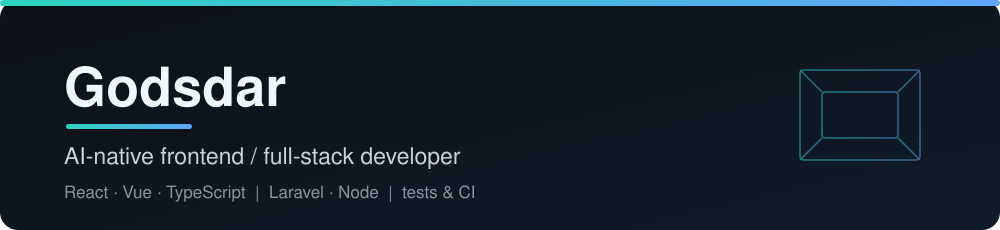
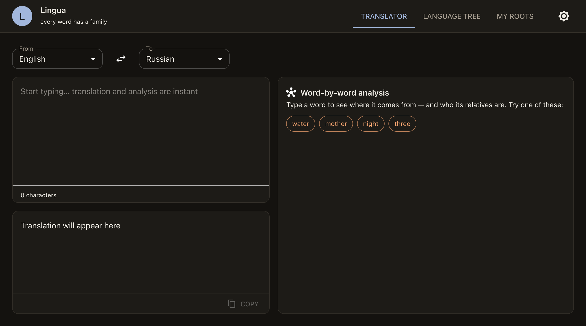
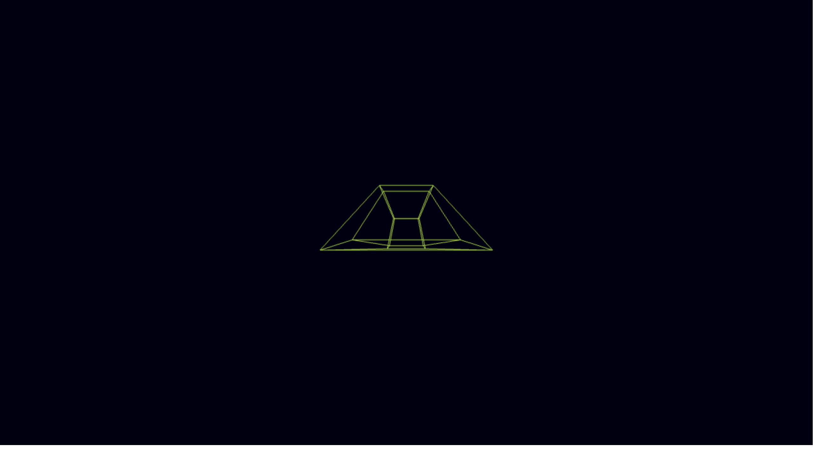
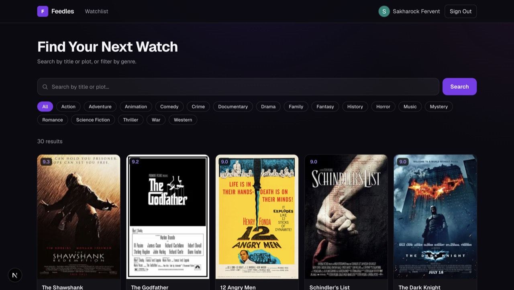

  

I build web apps with React and TypeScript, and I use Laravel or Node when a project needs a backend.

Browsers genuinely surprise me: how they work inside, and what you can draw with them in 2D and 3D.

I'm looking for a frontend or full-stack role, remote only, and I'm open to freelance work. I can write in English, Russian and Spanish.

## Projects

| Preview | Project | Links |
| --- | --- | --- |
|  | **Lingua** An etymology explorer that shares one core across a web app, a Chrome extension and an Electron desktop app. | [demo](https://godsdar.github.io/lingua/) · [code](https://github.com/Godsdar/lingua) |
|  | **chess-engine** A chess board that plays back, with a minimax and alpha-beta engine in TypeScript. | [demo](https://godsdar.github.io/chess-engine/) · [code](https://github.com/Godsdar/chess-engine) |
|  | **Tesseract** A 4D hypercube rendered in the browser with three.js. | [demo](https://godsdar.github.io/Tesseract/) · [code](https://github.com/Godsdar/Tesseract) |
|  | **CineShelf** A movie search app with real posters, a personal watchlist and sign-in. Next.js 16, PostgreSQL and Auth.js. | [code](https://github.com/Godsdar/CineShelf) |

Also on GitHub: **[Serenity](https://github.com/Godsdar/Serenity)** (a Laravel 12 and React blog with PHPUnit tests) and a **[React + Laravel blog](https://github.com/Godsdar/Simple-blog-React-Laravel-REST-API-)**.

I also build internal business tools for a client (Telegram analytics, timesheet and back-office tooling). Those stay private.

## Open source

Merged:

- [mergepay-web #413](https://github.com/mergepay/mergepay-web/pull/413): a Vitest suite for the expense-split logic.
- [mergepay-web #449](https://github.com/mergepay/mergepay-web/pull/449): error boundaries and fallback states for wallet and API transactions, with tests.
- [kana-dojo #29635](https://github.com/lingdojo/kana-dojo/pull/29635): fixed a broken JSON file that stopped the idioms from loading.
- [kana-dojo #29509](https://github.com/lingdojo/kana-dojo/pull/29509) and [#29507](https://github.com/lingdojo/kana-dojo/pull/29507): a Japanese proverb and a theme.

Open:

- [excalidraw #12026](https://github.com/excalidraw/excalidraw/pull/12026): Ctrl/Cmd+S should still save while CapsLock is on.

## How I work with AI

I work with coding agents a lot. I decide what to build and how it is structured, the agent writes a first version, and I read the diff and run the tests before I commit.

## What I like

I like the creative side of this work. I like the web and I like AI.

## Contact

- Email: ildar.popov.dev@gmail.com
- Upwork: https://www.upwork.com/freelancers/~01fec55e21f1f0fc51
- hh: https://almaty.hh.kz/resume/4a5654ceff107d051d0039ed1f356454725545
