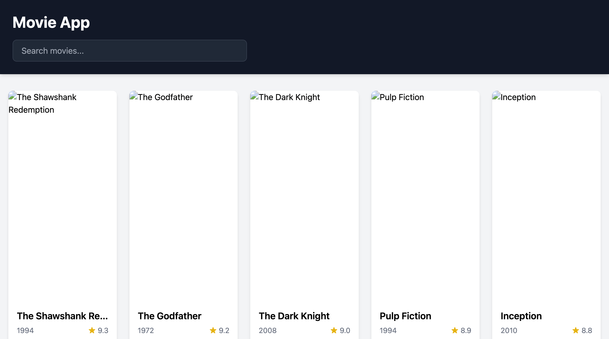

  

I build web apps with React and TypeScript, and I use Laravel or Node when a project needs a backend. I'm looking for a frontend or full-stack role, remote only, and I'm open to freelance work.

I got into programming because I wanted to make things and grow at the same time. It slowly turned into more than a job: it shapes how I think, even outside of code. Lately I've been working with an agentic loop, and I think AI will change what engineers actually do day to day.

I can write in English, Russian and Spanish.

## Projects

| Preview | Project | Links |
| --- | --- | --- |
|  | **Lingua** An etymology explorer that shares one core across a web app, a Chrome extension and an Electron desktop app. | [demo](https://godsdar.github.io/lingua/) · [code](https://github.com/Godsdar/lingua) |
|  | **chess-engine** A chess board that plays back, with a minimax and alpha-beta engine in TypeScript. | [code](https://github.com/Godsdar/chess-engine) |
|  | **Tesseract** A 4D hypercube rendered in the browser with three.js. | [code](https://github.com/Godsdar/Tesseract) |
|  | **Movie App** A React and TypeScript catalog with live search and detail pages. | [code](https://github.com/Godsdar/movie-app-on-react) |

I also build internal business tools for a client (Telegram analytics, timesheet and back-office tooling). Those stay private.

## Open source

Merged:

- [mergepay-web #413](https://github.com/mergepay/mergepay-web/pull/413): a Vitest suite for the expense-split logic.
- [mergepay-web #449](https://github.com/mergepay/mergepay-web/pull/449): error boundaries and fallback states for wallet and API transactions, with tests.
- [kana-dojo #29635](https://github.com/lingdojo/kana-dojo/pull/29635): fixed a broken JSON file that stopped the idioms from loading.
- [kana-dojo #29509](https://github.com/lingdojo/kana-dojo/pull/29509) and [#29507](https://github.com/lingdojo/kana-dojo/pull/29507): a Japanese proverb and a theme.

Open:

- [excalidraw #12026](https://github.com/excalidraw/excalidraw/pull/12026): Ctrl/Cmd+S should still save while CapsLock is on.

## How I work with AI

I mostly work in an agentic loop. I generate the ideas and decide what to build; the agents implement. I read the code they write, and I use them for the technical routine when it doesn't need my full attention. The checking is still on me.

## What I like, and what I don't

I like the creative side of this work. I like the web, and I like AI. Browsers genuinely surprise me: how they work inside, and what you can draw with them in 2D and 3D. What I get from engineering is a feeling I don't get anywhere else, the sense of learning new ideas and seeing how things are put together. What I still don't understand is C and C++ programmers who brag about their low-level skills.

## Contact

- Email: sakharockfervent@gmail.com
- Upwork: https://www.upwork.com/freelancers/~01fec55e21f1f0fc51
- hh.ru: https://almaty.hh.kz/resume/4a5654ceff107d051d0039ed1f356454725545
